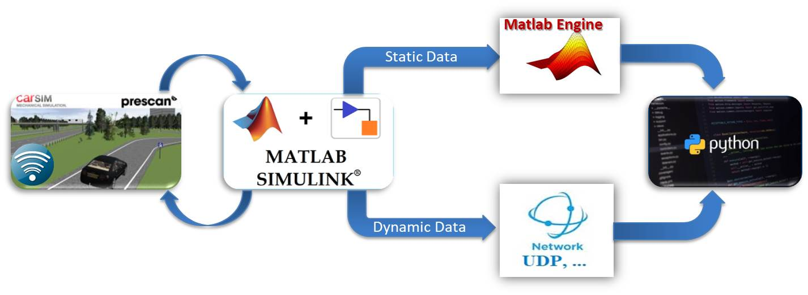
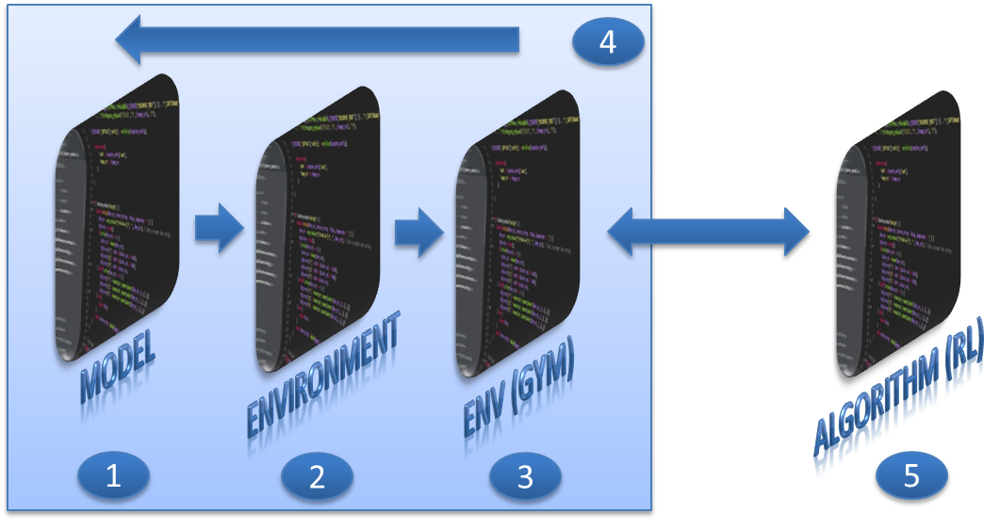

# gym-Prescan [](https://www.python.org/downloads/release/python-360/) [](https://www.mathworks.com/products/new_products/release2017b.html) [](https://www.mathworks.com/products/new_products/release2017b.html)
Developed by [@MohammadRaziei](https://github.com/MohammadRaziei/) 


### Files & Folders :
* **[gym\_prescan](https://github.com/MohammadRaziei/gym-Prescan/tree/master/gym_prescan)** : That's the main folder and provided as the __environment__.
    * [gym\_prescan/envs](https://github.com/MohammadRaziei/gym-Prescan/tree/master/gym_prescan/envs) : There is some codes writhen with python and registered in OpenAI-gym:
      * [gym\_prescan/envs/prescan_env.py](https://github.com/MohammadRaziei/gym-Prescan/blob/master/gym_prescan/envs/prescan_env.py): about ```prescan-v0```
      * [gym\_prescan/envs/prescan_env2.py](https://github.com/MohammadRaziei/gym-Prescan/blob/master/gym_prescan/envs/prescan_env2.py): about ```prescan-without-matlabengine-v0```
    * [gym\_prescan/envs/PreScan](https://github.com/MohammadRaziei/gym-Prescan/tree/master/gym_prescan/envs/PreScan): It's the __PreScan folder__.
* **[test](https://github.com/MohammadRaziei/gym-Prescan/tree/master/tests)** : There's some RL-algorithms using __stable-baseline__

### Standard test:
```python
import gym, gym_prescan

env_dict = {
    'id':       'prescan-without-matlabengine-v0',
    'host':     '172.21.217.140',
    'verbose':  True,
    'nget':     152
}
env = gym.make(**env_dict)
for i_episode in range(20):
    observation = env.reset()
    for t in range(100):
        env.render()
        print(observation)
        action = env.action_space.sample()
        observation, reward, done, info = env.step(action)
        if done:
            print("Episode finished after {} timesteps".format(t+1))
            break
env.close()
```


#### Explanation:
> * 'id' must be 'prescan-v0' or 'prescan-without-matlabengine-v0' 
> * 'host' can be ignored if you have local run ('host' takes 'localhost' as default.)
> * if 'verbose' took True as value, logs are allowed to be printed in terminal.
  
<!--
### Read more:
[ ![pdf][pdf] Download my BSc thesis in persian](README/AUTthesis-by-@MohammadRaziei.pdf) -->

[pdf]: README/pdf-small.png



<!---->


